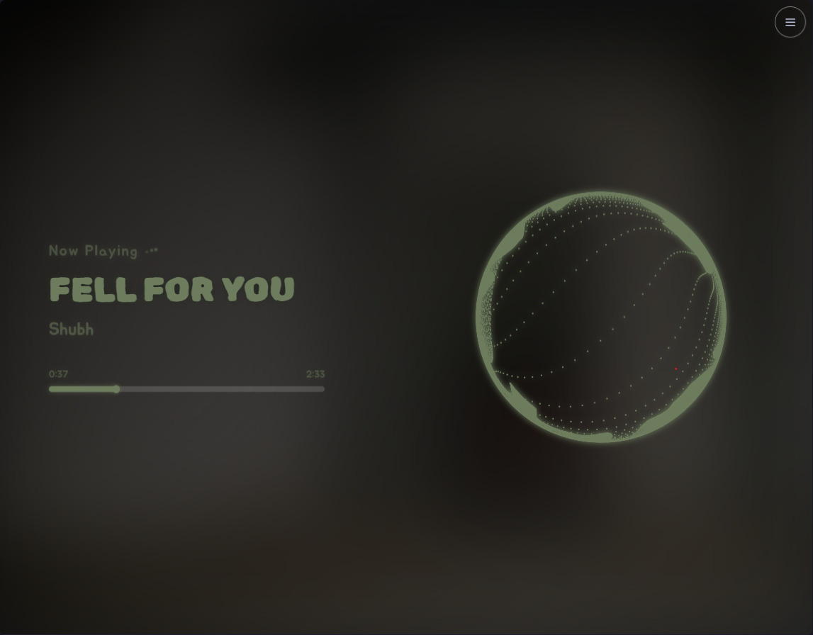
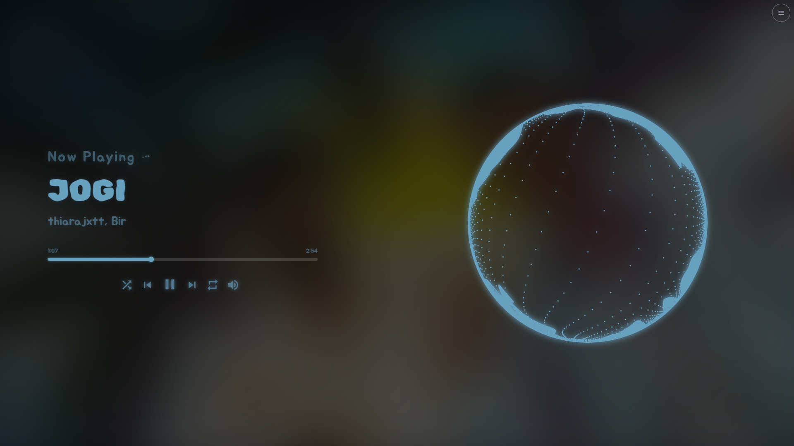

# NCS Visualiser
### A Real-Time Audio Visualizer for Spicetify

A WebGL2-powered particle sphere audio visualizer for Spotify using Spicetify. It synchronizes particle movements with Spotify's audio analysis, featuring dynamic color extraction, a beautiful fullscreen interface, playback controls, and built-in developer tools.

[](https://spicetify.app)
[](LICENSE)

---

## 📸 Preview

### Normal View


### Fullscreen View


---

## ✨ Features

- 🔴 **NCS-Style Particle Sphere:** High-performance WebGL2 particle system driven by real-time amplitude curves from Spotify's audio analysis.
- 🎨 **Dynamic Color Extraction:** Automatically extracts and applies theme colors from the playing track's album art.
- 🖥️ **Stunning Fullscreen Mode:** Toggle a minimal, beautiful overlay displaying the track name, artist, interactive seek bar, and playback controls.
- 🎛️ **Full Playback Controls:** Control Spotify directly from the visualizer with play/pause, next, previous, shuffle, and repeat buttons.
- 🔊 **Volume Controller:** Quick mute button with a smooth hover-reveal volume slider.
- 📊 **Developer Analysis Tools:** Built-in timeline overlays to visualize beats, bars, loudness, timbre, pitches, and rhythm analysis.
- 📐 **Responsive Design:** Completely fluid typography and layout scaling perfectly to any viewport size.

---

## 🚀 Installation

For help with installing or uninstalling, check out the official [Spicetify FAQ](https://spicetify.app/docs/faq) or ask on the [Spicetify Discord](https://discord.gg/VnevqPp2Rr). If you encounter any bugs or issues specific to this extension, please open an issue in the [Issues](https://github.com/WatashiAD/ncs-visualiser/issues) tab.

### Installation Instructions

1. **Open your Spicetify Config Directory**  
   Open your terminal/command prompt and run:
   ```bash
   spicetify config-dir
   ```
2. **Navigate & Create Folder**  
   Navigate to the `CustomApps` folder within that directory. Create a new folder named `visualizer`.
3. **Download Project Files**  
   Download the files from this repository and copy them into the `visualizer` folder you just created:
   - `index.js`
   - `manifest.json`
   - `style.css`
4. **Enable the Custom App**  
   Add the app to your Spicetify configuration by running:
   ```bash
   spicetify config custom_apps visualizer
   ```
5. **Apply Configuration**  
   Finalize the installation and apply changes to Spotify:
   ```bash
   spicetify apply
   ```
6. **Launch**  
   Restart Spotify. A new **Visualizer** button will appear in your sidebar/navigation panel!

---

## 🔄 Upgrading / Migrating

### Upgrading from the older "NCS Visualizer"

If you previously had the older `ncs-visualiser` installed, remove it first to avoid configuration conflicts:

1. Open your Spicetify config directory (`spicetify config-dir`).
2. Navigate to `CustomApps` and **delete** the `ncs-visualiser` folder.
3. Remove the old app from your configuration:
   ```bash
   spicetify config custom_apps ncs-visualiser-
   ```
4. Follow the **Installation Instructions** above to set up the new version.

---

## 🛠️ Usage & Controls

| Control / Action | Description |
| :--- | :--- |
| **Enter Fullscreen** | Click the menu button (top-right) → *Enter Fullscreen*, or press `F11`. |
| **Interactive Seek** | Click anywhere along the progress bar to seek playback time. |
| **Previous / Next** | Skip tracks using the overlay controls in fullscreen mode. |
| **Play / Pause** | Toggle playback using the fullscreen button or press `Space`. |
| **Shuffle / Repeat** | Toggle shuffle or repeat modes via fullscreen control toggles. |
| **Volume Control** | Hover over the volume icon to reveal the slider; click to mute/unmute. |
| **Switch Renderers** | Menu (top-right) → *Renderer* → choose between the WebGL particle sphere or analysis graphs. |
| **Picture-in-Picture** | Menu (top-right) → *Open Window* (opens visualizer in a standalone or PiP window). |

---

## 📁 File Structure

```
ncs-visualiser/
├── resources/
│   ├── FullScreen.png # Fullscreen mode preview screenshot
│   └── Normal.png     # Normal mode preview screenshot
├── index.js           # Main visualizer application (React + WebGL2)
├── style.css          # Visualizer styling, animations, and custom typography
├── manifest.json      # Spicetify custom app manifest definition
├── LICENSE            # License information
└── README.md          # Project documentation
```

---

## 🎨 Customization

You can customize the visualizer's appearance and sensitivity by editing these files directly:

- **Font Sizes & Layout:** Edit `style.css` to adjust dynamic fonts (using `clamp()`, `vw`, and `vh` units), overlay sizing (`max-width: 42%`), or canvas offset (`right: 5%`).
- **Colors:** All element styles use the CSS variable `var(--theme-color)`, which is dynamically updated at runtime.
- **Particle Behavior:** Adjust the particle physics and radius in `index.js` (search for `0.73` or `0.86`).

---

## 🛠️ Development & Building

There is **no build step required**! All React components and WebGL shaders are written inside `index.js`. 
You can edit `index.js` or `style.css` directly and then run:
```bash
spicetify apply
```
to see your changes instantly.

---

## 👥 Credits

- Built using the **[Spicetify](https://spicetify.app)** Custom App API.
- WebGL2 particle rendering inspired by standard NCS visualizer designs.
- Audio analysis data powered by **Spotify Web API**.
- Typography: [Rubik Spray Paint](https://fonts.google.com/specimen/Rubik+Spray+Paint) & [Jua](https://fonts.google.com/specimen/Jua) via Google Fonts.
- Icons: [Material Icons](https://fonts.google.com/icons) by Google.

---

## 📄 License

This project is licensed under the Apache License 2.0. See the [LICENSE](LICENSE) file for details.
