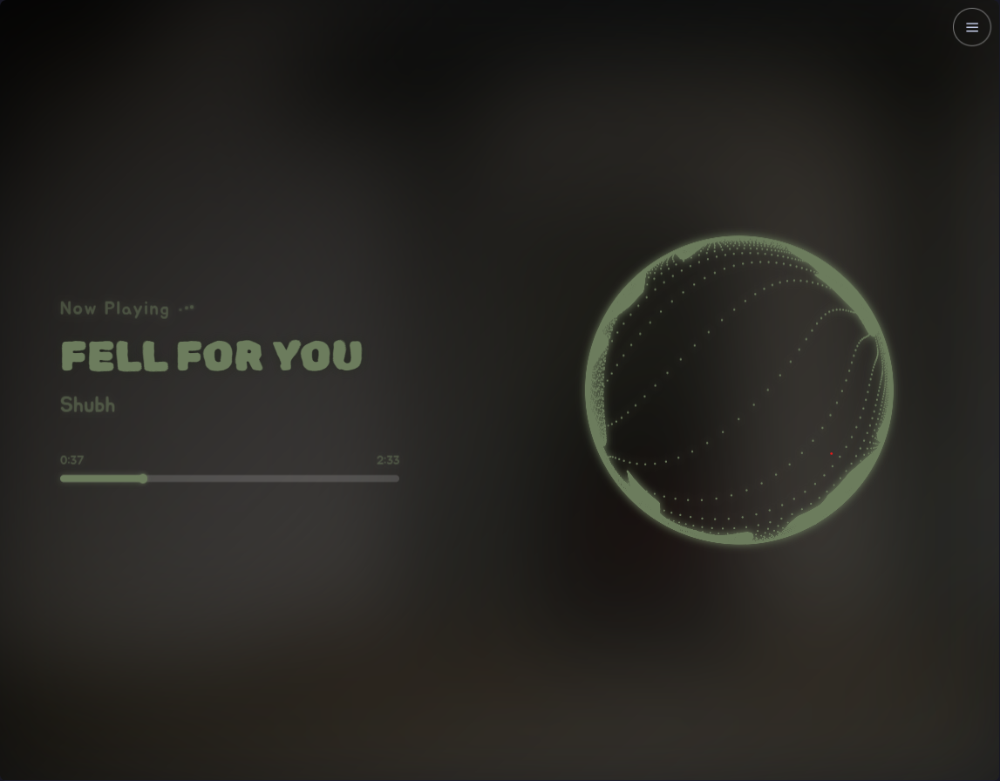
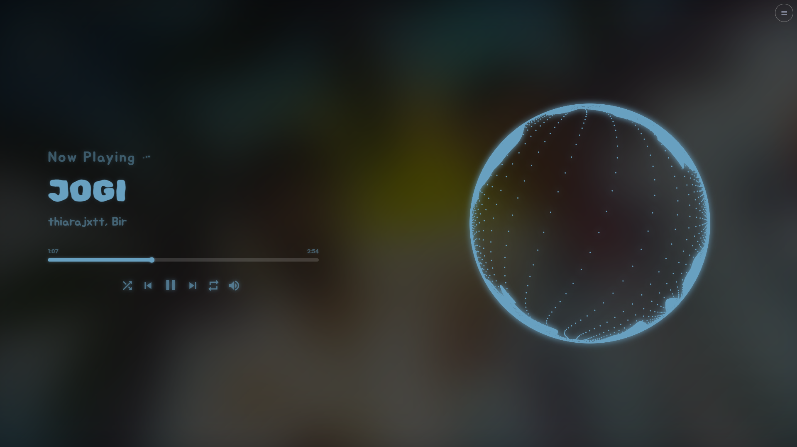

# NCS-Visualizer
### A Real-Time Audio Visualizer for Spicetify

A WebGL2-powered particle sphere audio visualizer for Spotify using Spicetify. It synchronizes particle movements with Spotify's audio analysis, featuring dynamic color extraction, a beautiful fullscreen interface, playback controls, and built-in developer tools.

[](https://spicetify.app)
[](LICENSE)

---

## 📸 Previews

<p align="center">
  
  
</p>

---

## ✨ Features

- 🔴 **NCS-Style Particle Sphere:** High-performance WebGL2 particle system driven by real-time amplitude curves from Spotify's audio analysis.
- 🎨 **Dynamic Color Extraction:** Automatically extracts and applies theme colors from the playing track's album art.
- 🖥️ **Stunning Fullscreen Mode:** Toggle a minimal, beautiful overlay displaying the track name, artist, interactive seek bar, and playback controls.
- 🎛️ **Full Playback Controls:** Control Spotify directly from the visualizer with play/pause, next, previous, shuffle, and repeat buttons.
- 🔊 **Volume Controller:** Quick mute button with a smooth hover-reveal volume slider.
- 📊 **Developer Analysis Tools:** Built-in timeline overlays to visualize beats, bars, loudness, timbre, pitches, and rhythm analysis.
- 📐 **Responsive Design:** Completely fluid typography and layout scaling perfectly to any viewport size.
- 🔄 **Built-in Auto-Updater:** One-click update from the top bar — no manual file copying needed.
- 🎤 **Synchronized Lyrics:** Real-time word-by-word animated lyrics with gradient fill, glow effects, and romanization support for Japanese, Chinese, and Korean.
- 🖼️ **Kawarp WebGL Background:** GPU-accelerated fluid animated backdrop driven by album art colors.

---

## 🚀 Installation

For help with installing or uninstalling, check out the official [Spicetify FAQ](https://spicetify.app/docs/faq) or ask on the [Spicetify Discord](https://discord.gg/VnevqPp2Rr). If you encounter any bugs or issues specific to this extension, please open an issue in the [Issues](https://github.com/WatashiAD/ncs-visualiser/issues) tab.

### Installation Instructions

1. **Open your Spicetify Config Directory**  
   Open your terminal/command prompt and run:
   ```bash
   spicetify config-dir
   ```
2. **Navigate & Create Folder**  
   Navigate to the `CustomApps` folder within that directory. Create a new folder named `ncs-visualizer`.
3. **Download Project Files**  
   Download the files from this repository and copy them into the `ncs-visualizer` folder you just created:
   - [`index.js`](index.js)
   - [`manifest.json`](manifest.json)
   - [`style.css`](style.css)
4. **Enable the Custom App**  
   Add the app to your Spicetify configuration by running:
   ```bash
   spicetify config custom_apps ncs-visualizer
   ```
5. **Apply Configuration**  
   Finalize the installation and apply changes to Spotify:
   ```bash
   spicetify apply
   ```
6. **Launch**  
   Restart Spotify. A new **Visualizer** button will appear in your sidebar/navigation panel!

---

## 🔄 Updating

The visualizer has a **built-in auto-updater**. When a new version is available, a download icon will appear in the top-right button bar of the visualizer.

### How to Update

1. **Click the download icon** in the top bar of the visualizer when it appears.
2. Wait for the files to download — a notification will confirm completion.
3. **Restart Spotify**, then run:
   ```bash
   spicetify apply
   ```

If the auto-updater cannot write directly to the app directory, the files will be downloaded to your **Downloads** folder. In that case, copy them into your Spicetify `CustomApps/visualiser/` directory manually before running `spicetify apply`.

---

## 🛠️ Usage & Controls

| Control / Action | Description |
| :--- | :--- |
| **Enter Fullscreen** | Click the menu button (top-right) → *Enter Fullscreen*, or press `F11`. |
| **Interactive Seek** | Click anywhere along the progress bar to seek playback time. |
| **Previous / Next** | Skip tracks using the overlay controls in fullscreen mode. |
| **Play / Pause** | Toggle playback using the fullscreen button or press `Space`. |
| **Shuffle / Repeat** | Toggle shuffle or repeat modes via fullscreen control toggles. |
| **Volume Control** | Hover over the volume icon to reveal the slider; click to mute/unmute. |
| **Switch Renderers** | Menu (top-right) → *Renderer* → choose between the WebGL particle sphere or analysis graphs. |
| **Picture-in-Picture** | Menu (top-right) → *Open Window* (opens visualizer in a standalone or PiP window). |

---

## 📁 File Structure

- 📁 **[resources/](resources/)**
  - 🖼️ **[FullScreen.png](resources/FullScreen.png)** — Fullscreen mode preview screenshot
  - 🖼️ **[Normal.png](resources/Normal.png)** — Normal mode preview screenshot
- 📄 **[index.js](index.js)** — Main visualizer application (React + WebGL2)
- 📄 **[style.css](style.css)** — Visualizer styling, animations, and custom typography
- 📄 **[manifest.json](manifest.json)** — Spicetify custom app manifest definition
- 📄 **[LICENSE](LICENSE)** — License information
- 📄 **[README.md](README.md)** — Project documentation

---

## 🎨 Customization

You can customize the visualizer's appearance and sensitivity by editing these files directly:

- **Font Sizes & Layout:** Edit [`style.css`](style.css) to adjust dynamic fonts (using `clamp()`, `vw`, and `vh` units), overlay sizing (`max-width: 42%`), or canvas offset (`right: 5%`).
- **Colors:** All element styles use the CSS variable `var(--theme-color)`, which is dynamically updated at runtime.
- **Particle Behavior:** Adjust the particle physics and radius in [`index.js`](index.js) (search for `0.73` or `0.86`).

---

## 🛠️ Development & Building

There is **no build step required**! All React components and WebGL shaders are written inside [`index.js`](index.js). 
You can edit [`index.js`](index.js) or [`style.css`](style.css) directly and then run:
```bash
spicetify apply
```
to see your changes instantly.

---

## 👥 Credits & Attribution

- **Original Creator:** Originally designed and developed by **[Konsl](https://github.com/Konsl)** as **[spicetify-visualizer](https://github.com/Konsl/spicetify-visualizer)**.
- **Core Platform:** Built using the **[Spicetify](https://spicetify.app)** Custom App API.
- **Audio Rendering:** WebGL2 particle rendering inspired by NCS visualizer concepts.
- **Data Source:** Audio analysis data powered by the **Spotify Web API**.
- **Typography:** [Rubik Spray Paint](https://fonts.google.com/specimen/Rubik+Spray+Paint), [Sniglet](https://fonts.google.com/specimen/Sniglet) & [Mochiy Pop One](https://fonts.google.com/specimen/Mochiy+Pop+One) via Google Fonts.
- **Icons:** [Material Icons](https://fonts.google.com/icons) by Google.

---

## 📄 License

This project is licensed under the Apache License 2.0. See the [LICENSE](LICENSE) file for details.
